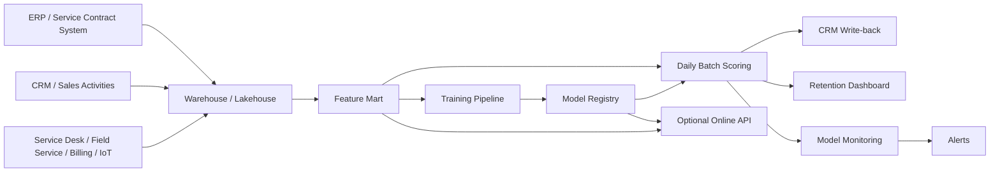
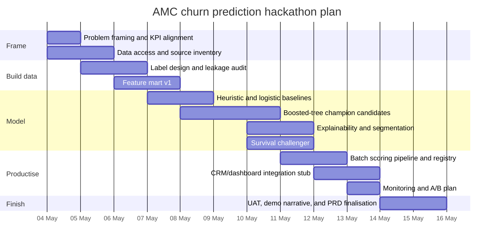

# PRD for AMC Renewal Retention Prediction in Customers and Sales

## Executive summary

This product is a contract-renewal intelligence layer for Annual Maintenance Contracts (AMCs). Its purpose is to identify AMC contracts or contract items most likely not to renew, early enough for the renewal team to intervene with the right action, at the right time, through the right channel. The business rationale is strong: research on B2B service contracts shows that renewal behaviour is shaped by service operations, customer satisfaction, price, contract-level experiences, service usage, and relationship history. Recent maintenance-contract and rental-service work also shows that billing, service interactions, contact history, equipment usage, and contract lifecycle signals can be turned into operational churn models that support more personalised retention action. citeturn14view5turn14view6turn16view4turn16view6turn31view0turn28view1

For a 12-day hackathon, the right product shape is a batch-first, decision-support system rather than a full autonomous renewal platform. The recommended delivery is a daily score for contracts due to expire in the next 30–90 days, presented in the CRM with top risk drivers, suggested playbook, and prioritised worklist. The modelling strategy should be champion–challenger: heuristic rules and regularised logistic regression as baselines, gradient-boosted trees as the main champion candidate, and a survival model as an advanced challenger for timing-sensitive outreach. Churn research consistently shows strong performance from ensemble methods, while recent survival-analysis work shows added value when the business needs to know not only who is at risk, but when risk peaks. citeturn16view0turn16view1turn24view1turn28view0

The hackathon should be judged primarily on whether it produces a credible retention workflow, not just a good notebook. A successful output is a working labelled dataset, baseline and champion model results, explainability views, a scheduled scoring pipeline, CRM write-back mock or stub, a monitoring design, and an A/B testing plan for field rollout. Maintenance-contract case evidence is instructive here: even a technically sound model can be underused if predictions are inconsistent, explanations are weak, or the output does not fit how sales teams actually work. citeturn28view0turn28view2turn20view6turn16view11

> **Assumptions used in this PRD**
>
> - The organisation can access AMC contract, billing, service, and CRM interaction data.
> - Final renewal decisions remain under human ownership; the model prioritises and informs, but does not autonomously change commercial terms.
> - An enterprise warehouse or lakehouse already exists, or can be provisioned quickly for the hackathon.
> - No hard budget or compute ceiling has been specified, so design choices prioritise speed-to-evidence, auditability, and operational simplicity over minimum-cost architecture.
> - Unless business rules prove otherwise, the default actionability window is **60 days before contract end**, and the default churn label is **not renewed by 30 days after expiry**.

## Product context and scope

**Problem statement**

AMC renewal work is often reactive. Teams tend to focus on expiring contracts, relationship tenure, or a few anecdotal warning signs rather than the full behavioural and operational signal set. Real-world contract businesses have shown this pattern before: domain teams frequently rely on crude heuristics such as months of use or coarse cluster-level “defence” strategies, even though richer contract, service, and interaction data exist. The result is predictable: too many high-risk contracts are missed, low-risk contracts consume attention, and renewal activity happens too late. citeturn31view0turn31view5

In AMC specifically, the signal is not purely commercial. Contract renewal can depend on service quality, technician performance, call-centre experience, product quality, price adaptation, asset usage, billing friction, and what happened on other related contracts under the same customer. B2B service-contract literature and maintenance-contract case work both point to this multi-layered structure, which is why a pure “sales-only” view is insufficient. citeturn14view5turn14view6turn16view4turn28view1

**What this PRD solves**

This PRD defines an AMC churn-prediction product that:

1. predicts non-renewal risk for each contract or contract item in a pre-renewal window;
2. explains *why* the risk is high using business-readable features;
3. prioritises outreach under finite renewal-team capacity;
4. writes the prioritised list and evidence back into existing seller workflows; and
5. measures whether the new workflow improves retention and retained renewal value.

**What this PRD does not solve**

This PRD does **not** attempt to build a full contract lifecycle management suite, a pricing optimiser, or a fully automated decision-maker. It also does not assume streaming or real-time scoring unless a concrete consuming workflow requires it. That restraint is deliberate: mainstream enterprise platforms already provide contract management, renewals administration, and expiring-contract visibility, but the distinctive value here is risk prediction for AMC renewals using domain-specific service and asset signals. citeturn19view3turn19view4turn16view9turn17search0turn17search3

**Target users and stakeholders**

| Group | Primary need | How the product helps |
|---|---|---|
| Renewal managers | Know which renewals need immediate action | Prioritised risk list, pipeline view, retention dashboard |
| Account managers / sales reps | Understand which accounts to call and why | Contract-level risk score, top drivers, recommended action |
| Customer success / service operations | See service issues affecting renewal | SLA, ticket, visit, and asset-risk context linked to renewal risk |
| Pricing / RevOps | Protect margin while improving retention | Revenue-at-risk view, discount guardrails, segment analysis |
| Data science / MLOps | Build, govern, and improve the model | Reproducible pipeline, registry, drift monitoring, evaluation pack |
| Compliance / legal | Ensure lawful and proportionate use | Human-in-the-loop design, minimised data usage, audit trail |
| Executive sponsor | Judge business value | Cohort retention uplift, retained renewal revenue, adoption metrics |

Commercial platforms already frame churn and renewal prediction as cross-functional workflows spanning CRM, service, back-office, and customer-health functions, which supports this stakeholder map. citeturn20view6turn16view11turn16view9turn19view3

**Success metrics**

The metric system should be cohort-based, measured on contracts due for renewal in a defined period. That matters because churn and renewal can be overstated or distorted if new additions are mixed into the same denominator. Commercial guidance also distinguishes customer churn from revenue churn, and renewal-forecast tooling commonly tracks renewed value net of downsell and churn. citeturn16view7turn14view9

| Metric type | KPI | Definition | Why it matters |
|---|---|---|---|
| Primary | **AMC retention rate** | Renewed AMC contracts (or contract items) / AMC contracts due for renewal in the cohort | Direct measure of the business objective |
| Secondary | Renewal revenue retention | Renewed AMC renewable value / total AMC renewable value in cohort | Protects against “retention at any cost” |
| Secondary | Gross renewal margin retained | Gross margin on renewed contracts attributable to interventions | Keeps incentives economically rational |
| Secondary | Revenue churn | Lost renewable value net of downsell and approved uplift logic | Financial health view |
| Secondary | At-risk capture rate | Share of actual non-renewals found inside top-K scored contracts | Tests prioritisation utility |
| Secondary | Recall at outreach capacity | Churners captured in top N contracts aligned to team capacity | Operationally useful version of recall |
| Secondary | Intervention conversion | Renewed after outreach / contacted at-risk contracts | Measures workflow effectiveness |
| Secondary | Time-to-intervention | Median days between first risk flag and contract expiry | Ensures enough time to act |
| Secondary | Seller adoption | Share of scored contracts actually reviewed or actioned | Avoids “accurate but unused” outcomes |
| Guardrail | Discount leakage | Incentive spend or margin give-up per retained contract | Stops over-discounting |
| Guardrail | Customer complaints / SLA breaches | Change in complaint rate or service burden post-rollout | Prevents retention actions harming service quality |

**Scope decision**

The **MVP scoring unit** should be the **contract item where renewal can happen at item level**, otherwise the whole contract. This is preferable because service contracts in mainstream service-management systems can differ by service level, covered devices, product entitlement, and price agreement at item level; using too coarse a unit can blur the actual renewal decision. citeturn19view4turn19view5

## Data, privacy, and label design

The product should use a **unified contract-renewal feature mart** keyed by `contract_item_id` (preferred) or `contract_id`, joined to customer/account, asset/equipment, service, billing, and CRM activity tables at a fixed score date. Contract-renewal research and real operating case studies both support combining contract information, transaction data, service usage, and customer–firm interaction data rather than relying on one domain alone. citeturn31view0turn31view5turn14view5turn16view4

| Source domain | Key entities | Minimum fields needed in MVP | Notes |
|---|---|---|---|
| Contract master | contract, contract item, account | contract ID, item ID, account ID, start date, end date, contract term, service level, covered product/asset, auto-renew flag, contract status, renewable value | Core labelling and scoring universe |
| Customer / account | account, segment, region | account hierarchy, industry, territory, installed base size, tenure, strategic tier | Needed for segmentation and assignment |
| Asset / equipment | equipment, installed asset | asset age, model, warranty overlap, utilisation summary, availability, downtime | Important for AMC-specific context |
| Service operations | work order, ticket, visit | ticket counts, resolution time, SLA breaches, repeat calls, preventive vs corrective visits, first-time-fix proxy, escalation history | Strong renewal driver family |
| Billing / finance | invoice, payment, credit note | invoice dates, payment delay, outstanding amount, disputes, bad debt markers, write-offs, price changes | Billing friction often predicts churn |
| CRM / sales activity | call, meeting, opportunity, note | outreach recency, outreach volume, quote sent date, quote age, negotiation iterations, last meeting date, competitor mention flags | Needed for last-mile renewal workflow |
| Interaction / support | email, call centre, portal | opens, clicks, replies, call count, call types, portal logins, inactivity windows | Strong engagement signal family |
| Marketing / offer history | offer, campaign | prior incentives, acceptance, decline, channel, offer type | Helps avoid reward leakage and policy bias |
| Telemetry / IoT | event, alarm, usage stream | alarms, uptime, maintenance frequency, sensor exceptions, usage intensity | Optional but high-value when available |
| Survey / feedback | CSAT, NPS, complaints | satisfaction score, complaint category, complaint severity | Use only where governance is clear |

The **minimum viable schema** should include one row per scored unit and the following standard fields: `snapshot_date`, `score_window_days`, `contract_end_date`, `days_to_expiry`, `renewal_status`, `renewal_event_date`, `renewable_value`, `gross_margin_proxy`, plus engineered feature columns. Every feature must be point-in-time correct relative to `snapshot_date`. That is non-negotiable: time-based validation is necessary because random splitting in time-series-like churn problems can leak future information and inflate apparent performance. citeturn28view2

**Feature engineering principles**

The best feature ideas in AMC are not generic demographic descriptors; they are signals closest to the value created by the service. In maintenance-contract research, examples close to value creation include equipment usage and billing activity. In rental-service churn studies, domain-derived features from contract application, installation, operation, changes, contact history, and service behaviour materially improved results and enabled more targeted retention actions. citeturn28view1turn31view0turn31view3turn31view5

| Feature family | Examples | Design comment |
|---|---|---|
| Contract structure | term length, time remaining, prior renewal count, contract type, auto-renew flag, covered asset count | Segment by contract structure where behaviour differs materially |
| Commercials | contracted price, discount level, price increases, quote delta, price adaptation events | Keep a margin lens from day one |
| Service quality | SLA breach count, mean response time, resolution backlog, repeat visit rate, call-centre issues | Often the cleanest operational proxy for satisfaction |
| Asset performance | downtime, alarm frequency, usage intensity, preventive/compliance task completion | Especially important in AMC and facilities contexts |
| Billing behaviour | late-payment streak, invoice disputes, credit note count, collections activity | High signal, low latency |
| Engagement | calls, meetings, email response, portal usage, inactivity, quote interaction | Strong evidence family in churn practice |
| Relationship context | tenure, relationship length, product breadth, portfolio size, other active contracts | Supports account-level spillover effects |
| Renewal journey | days since quote, legal/procurement delay, renewal owner changes, missed follow-up | Useful for “save the quarter” operations |
| Satisfaction proxies | CSAT, complaint frequency, complaint severity, escalation ratio | Use only if governance and completeness are acceptable |

The maintenance-contract literature also suggests that **customer-level and contract-level churn should be separated** when one customer can hold multiple active contracts simultaneously. In AMC, this is common, so the feature mart should include both the scored unit’s own behaviour and portfolio-level context for the parent account. citeturn28view1

**Label design**

For the hackathon, the label should be explicit and operational rather than abstract:

- **Positive class:** `non_renewal = 1` if the contract or contract item due to expire on date `T` is not renewed by `T + 30 days`.
- **Score date:** default `T - 60 days`.
- **Observation window:** features aggregated from `T - 425 days` up to `T - 60 days`, with shorter rolling windows layered on top.
- **Exclusions:** cancelled for known administrative reasons, merged duplicate contracts, non-standard one-off exceptions, and records with unresolved renewal-outcome ambiguity.

A maintenance-contract case study found that **improving the target definition around the time horizon** immediately improved performance, and that **segmenting by contract length** was a productive improvement strategy. That finding is highly relevant here. citeturn28view0

**Privacy, governance, and compliance**

The analytics layer should use **pseudonymised identifiers**, with the identity mapping stored separately under tighter access controls. A real-world service churn study used pseudonymised identifiers when moving customer data into the analysis platform, and UK GDPR guidance is clear that data used for profiling should be adequate, relevant, and limited to what is necessary. citeturn31view5turn14view17

The model should be positioned as **decision support**, not as a solely automated decision-maker. UK GDPR guidance restricts solely automated decisions with legal or similarly significant effects and expects organisations to assess risk through a DPIA where such processing applies. If the product only prioritises contracts for human review and does not autonomously deny service, alter rights, or impose binding pricing outcomes, the compliance posture is materially safer, but the general data-protection principles still apply. citeturn14view16turn14view17

The minimum governance package should therefore include:

- purpose limitation documented in the PRD and DPIA screening;
- role-based access in the warehouse, model output layer, and CRM write-back;
- encrypted storage and transport;
- feature lineage and model-version traceability;
- retention limits for feature snapshots and explanations;
- a documented human review step before any material commercial action.

## Model strategy and evaluation

Recent churn literature suggests three important things. First, **tabular churn tasks are still a strong fit for classical and ensemble machine learning**, especially tree boosting. Second, **there is no universally best classifier**, so champion–challenger evaluation matters more than ideology. Third, **profit-based and business-aware evaluation** remain under-used in the literature and deserve first-class treatment in operational design. citeturn16view0turn16view1turn25search3turn26search5

For AMC, the recommended modelling portfolio is deliberately narrow for the hackathon: a sanity-check heuristic, a transparent statistical baseline, a strong tabular champion, and one advanced timing-aware challenger.

| Model option | What it does well | Main weakness | Fit for 12-day hackathon | PRD decision |
|---|---|---|---|---|
| Heuristic rules | Very fast, transparent, good for stakeholder trust and smoke tests | Brittle, shallow, low recall, poor ranking quality | Excellent | Mandatory benchmark |
| Regularised logistic regression | Interpretable baseline, stable, easy to calibrate | Limited non-linearity and interaction capture | Excellent | Mandatory baseline |
| Random forest | Robust non-linear baseline, strong against noisy features | Larger models, often weaker calibration and ranking than boosting | Good | Optional challenger |
| Gradient-boosted trees | Strong performance on mixed tabular data, good ranking quality, practical explainability | Needs careful leakage control and sensible hyperparameter tuning | Excellent | Expected MVP champion |
| Survival model | Predicts *when* risk peaks, handles censoring and contract timing | More complex labels, evaluation, and explanation | Moderate | Advanced challenger |
| Stacked / heterogeneous ensemble | Can achieve top benchmark performance | Governance-heavy, complex, slower to harden | Poor for hackathon | Future phase, not MVP |

This comparison is consistent with the state of the literature: large churn benchmarks rank heterogeneous ensembles highly on AUC and expected maximum profit, but they also underline that results vary by dataset and metric; other recent studies continue to show strong practical performance from tree ensembles over classical baselines. For AMC specifically, a maintenance-contract case study used gradient-boosted trees in production but improved results only after fixing target logic and introducing segmentation. citeturn16view0turn16view1turn27view0

**Recommended model plan**

- **Baseline 0:** business heuristic score based on `days_to_expiry`, `late_payments`, `open_escalations`, `SLA_breaches`, and `quote_missing`.
- **Baseline 1:** regularised logistic regression with monotonic business sanity checks where appropriate.
- **Champion candidate:** gradient-boosted trees, training both **XGBoost** and CatBoost if time allows, then selecting the best by calibrated holdout performance and business simulation. XGBoost remains a strong practical choice because it is a mature, scalable tree-boosting system for tabular ML. citeturn30view0
- **Advanced challenger:** survival analysis, preferably Cox PH for interpretability or a more flexible survival method if enough time remains. Recent work shows survival models are valuable because they estimate hazard over time rather than only a fixed-horizon binary label. citeturn24view1

**Why not deep learning as the hackathon default**

A recent maintenance-contract industry thesis argues that heterogeneous tabular business data and the need for explanation still favour more traditional ML for many churn cases, and that black-box models can hurt adoption when stakeholders do not understand the reasoning. That is a sensible constraint for a renewal-focused hackathon. citeturn27view0turn28view2

**Feature engineering ideas**

The model should encode value-creation, friction, and timing. Renewal literature points to satisfaction, price, service quality, and usage behaviour; AMC-specific work adds equipment usage and billing-related events; renewal/upgrade studies add relationship- and contract-level effects. citeturn14view5turn14view6turn16view4turn16view6turn28view1

Suggested engineered features:

| Theme | Examples |
|---|---|
| Renewal timing | days to expiry, month-end proximity, quarter-end proximity, time since quote, days since last outreach |
| Service burden | work orders last 30/90/180 days, mean time to resolve, repeat incidents, backlog aging |
| Quality consistency | variance of SLA performance, extreme poor service events, missed preventive visits |
| Billing stress | overdue ratio, disputed invoices, amount past due, number of credits, payment channel change |
| Utilisation / asset stress | downtime ratio, alarm bursts, maintenance intensity, availability misses, spare-part usage |
| Relationship health | tenure, prior renewals, breadth of installed base, share of portfolio under contract, active sibling contracts |
| Engagement | calls, meetings, portal logins, unanswered outreach, inbound complaint rate, quote engagement |
| Commercial posture | discount history, price delta to prior term, service-level changes, consumption-to-price ratio |
| Segment flags | contract length bucket, product family, region, account tier, service team, asset category |

A useful **MVP prioritisation score** is not just raw churn probability. The write-back field in CRM should combine probability with value and actionability:

`priority_score = churn_probability × renewable_value × actionability_weight`

where `actionability_weight` down-ranks contracts already closed, administratively blocked, or outside team remit.

**Explainability**

SHAP is the right explainability default for the hackathon because it provides local feature attribution for each prediction and global views across the portfolio. The original SHAP paper frames these values as feature-attribution scores for a particular prediction, and real-world churn studies have used SHAP to support customer-specific retention actions. citeturn29view0turn31view2

However, the UI and training deck must state one important rule explicitly: **SHAP is explanatory, not causal**. A maintenance-contract case study warns that SHAP and similar methods can be misused for real-world causal inference, and that end users need some literacy in how explanations are produced if over-trust is to be avoided. citeturn28view2

**Evaluation metrics**

Class imbalance is normal in churn and non-renewal prediction. Churn research therefore recommends using evaluation metrics suited to rare-event ranking, including AUC and lift, and the precision–recall view is generally more informative than ROC alone on imbalanced data. Calibration also needs its own treatment; Brier score should not be treated as calibration by itself. citeturn14view2turn14view3turn32view0

**Default evaluation gates**

| Metric | Why it matters | MVP gate | Stretch target |
|---|---|---:|---:|
| ROC-AUC | Broad ranking separability | ≥ 0.75 | ≥ 0.80 |
| PR-AUC | Better than ROC for imbalance-sensitive ranking | ≥ max(0.30, 2 × class prevalence) | ≥ max(0.40, 2.5 × class prevalence) |
| Top-decile lift | Practical campaign prioritisation quality | ≥ 2.5 | ≥ 3.5 |
| Recall at top 10% of contracts | Captures churners at finite team capacity | ≥ 25% | ≥ 35% |
| Precision at top 10% | Actionability of the worklist | ≥ 2 × base churn rate | ≥ 3 × base churn rate |
| Calibration error | Trustworthy probability interpretation | ECE ≤ 0.05 | ECE ≤ 0.03 |
| Calibration slope | Detects over/under-confidence | 0.9–1.1 | 0.95–1.05 |
| Brier score | Probability quality on same holdout | Better than logistic baseline | ≥ 10% better than logistic baseline |
| Business simulation | Net retained value after contact and incentive cost | Positive | ≥ 5% over BAU prioritisation |

These thresholds are intentionally explicit but still assumption-based. They should be tightened or loosened once the true non-renewal base rate, outreach capacity, and retained-margin model are known.

**Validation design**

The evaluation split should be chronological:

- train on earlier renewal cycles;
- validate on the next cycle;
- hold out the most recent complete cycle for final comparison.

Additionally, if data volume allows, train **segmented models by contract length or product family**, because both maintenance-contract and recent survival-analysis work suggest product- or contract-type-specific models can outperform one-model-for-all approaches. citeturn28view0turn24view1

## Architecture, integration, and experimentation

The architecture should be **batch-first, warehouse-centred, and observable**. That is the fastest route to a credible hackathon outcome and aligns well with AMC renewal cycles. Official documentation supports the recommended building blocks: Airflow is designed for batch-oriented workflow scheduling; warehouse-native CDC can capture contract changes; Feast provides offline and online feature management; MLflow provides model lineage and versioning; FastAPI is a practical Python API layer; KServe adds Kubernetes-native inference serving when an online endpoint is truly required; Prometheus, Alertmanager, and Grafana cover operational metrics, alert routing, and dashboards; and Evidently provides drift checks for input data and predictions. citeturn14view12turn20view1turn20view5turn14view11turn20view4turn14view10turn14view19turn14view15turn20view0turn14view13turn14view14turn33view0turn20view2

**Preferred stack**

| Layer | Preferred choice | Why this is the right default |
|---|---|---|
| Languages | Python and SQL | Fastest path for feature engineering, modelling, scoring, and reproducibility |
| Storage | Existing enterprise warehouse/lakehouse plus object storage | Best reuse of current data estate; easiest integration with reporting |
| Data ingestion | Warehouse-native CDC or scheduled extracts | Sufficient for renewal use cases; low engineering overhead |
| Transformation | SQL models with version control | Keeps feature logic inspectable and portable |
| Orchestration | Airflow | Strong batch scheduling and dependency handling |
| Feature management | Feast where offline/online parity is needed | Avoids train–serve skew if API scoring arrives later |
| Training libraries | scikit-learn, XGBoost, CatBoost, lifelines or scikit-survival, SHAP | Covers baseline, champion, and advanced challenger |
| Model governance | MLflow | Versioning, lineage, aliases, model lifecycle |
| Serving | Daily batch scoring first; optional FastAPI + KServe endpoint | Aligns effort with business need |
| Monitoring | Evidently + Prometheus + Grafana + Alertmanager | Covers data drift, model metrics, dashboards, notifications |
| Activation | CRM task generation + BI dashboard | Meets renewal team where they already work |

**Integration points**

Commercial and service-management platforms show a consistent pattern: effective churn or renewal workflows depend on a unified view spanning CRM, contract data, service history, and back-office context. Oracle positions renewal and upgrade management around CRM-plus-back-office integration; Salesforce’s churn product combines revenue history, service history, case data, billing, network, and usage signals; SAP service-contract tooling links service contracts, service orders, pricing, analytics, expiring-contract monitoring, and auto-renewal behaviour. That pattern strongly supports a design with integration points into CRM, service management, billing, and the contract system of record. citeturn16view9turn20view6turn19view3turn19view4turn17search0turn17search3

The concrete integration design should be:

- **Read from** contract system of record, billing, service desk/field service, CRM activity logs, and telemetry where available.
- **Write to** CRM task queue, renewal dashboard, and portfolio views.
- **Optionally write** a daily scored export for RevOps or marketing automation if outreach is centrally coordinated.
- **Never write** directly to customer-facing pricing or contract states from the model in the MVP.

**Monitoring and alerting**

Monitoring should include both ML health and operational health. Evidently’s data-drift preset is suitable for comparing current and reference distributions, while Prometheus and Alertmanager are appropriate for time-series metrics and routed operational alerts. citeturn20view2turn14view13turn14view14

| Area | Signal | Threshold | Owner | Response |
|---|---|---|---|---|
| Data freshness | Latest source arrival lag | Warn at 24h, critical at 48h | Data engineer | Fail scoring job or mark stale |
| Schema integrity | Missing/renamed critical columns | Any breaking change | Data engineer | Stop pipeline, open incident |
| Feature null surge | Null rate increase in critical fields | > 5 percentage points | Data engineer | Backfill or impute with review |
| Feature drift | PSI / drift tests / dataset drift | PSI > 0.2 or drift on significant share of critical columns | DS / MLOps | Investigate retrain need |
| Score drift | Mean or percentile shift | > 3 standard deviations from recent baseline | DS / MLOps | Check upstream data and retrain candidate |
| Model performance | PR-AUC, recall@capacity after label maturity | > 10% relative decline | DS lead | Roll back or retrain |
| CRM delivery | Write-back failure rate | > 1% failed writes | Backend / integration | Retry and alert |
| Business guardrails | Discount leakage or complaint rate | > 15% increase without retention gain | RevOps / sponsor | Pause treatment policy |

**A/B testing plan**

The product rollout should be tested as a **workflow intervention**, not as a model beauty contest. Controlled experiments remain the best scientific design for establishing a causal relationship between the workflow change and observed outcomes, and experimentation literature also emphasises the value of a clear overall evaluation criterion and the mapping between leading indicators and lagging business outcomes. citeturn21view0turn21view3turn21view2

Recommended design:

- **Unit of randomisation:** account family where multiple AMC contracts can contaminate each other; otherwise contract item.
- **Control:** existing renewal workflow using current heuristics and manual prioritisation.
- **Treatment:** model-driven prioritisation plus risk reasons and playbook guidance.
- **Primary OEC:** cohort AMC retention rate.
- **Secondary OECs:** retained renewal revenue, gross margin retained, recall at outreach capacity, time-to-intervention.
- **Guardrails:** discount rate, complaints, service load, seller workload, SLA breaches.
- **Pre-check:** one A/A instrumentation test cycle to validate randomisation and data quality.
- **Analysis:** intention-to-treat, stratified by segment, region, and contract value tier, with a 95% confidence standard unless the experimentation team specifies otherwise.

The treatment itself should be modest in the first live rollout: prioritised worklists, risk drivers, and recommended actions. Save fully automated incentives or scripted price moves for later phases.

## Delivery plan and team

The hackathon objective is **evidence of viability**, not full production hardening. In 12 days, the team should aim to prove that AMC non-renewal can be predicted with enough quality and enough operational fit to justify a formal pilot.

| Day | Date | Goal | Output |
|---|---|---|---|
| Day 1 | 4 May 2026 | Align business problem, KPI tree, assumptions, and data access | Signed problem framing, cohort definition draft |
| Day 2 | 5 May 2026 | Inventory sources and define scoring unit | Source map, join keys, access checklist |
| Day 3 | 6 May 2026 | Finalise label, leakage rules, and time splits | Label spec, exclusion rules, validation split |
| Day 4 | 7 May 2026 | Build feature mart v1 and baseline heuristic | Reproducible training table, heuristic benchmark |
| Day 5 | 8 May 2026 | Train logistic baseline and calibrate | Baseline model card and metrics |
| Day 6 | 9 May 2026 | Train XGBoost/CatBoost champion candidates | Candidate leaderboard |
| Day 7 | 10 May 2026 | Explainability, error analysis, segment checks | SHAP views, false-positive/false-negative review |
| Day 8 | 11 May 2026 | Segment-by-contract-length variants and survival challenger | Segment results, survival proof-of-concept |
| Day 9 | 12 May 2026 | Package batch scoring and model registry | Scheduled scoring job, versioned artefacts |
| Day 10 | 13 May 2026 | CRM write-back stub and dashboard | Demo workflow with prioritised contract list |
| Day 11 | 14 May 2026 | Monitoring design and A/B testing plan | Alerts, dashboards, live-test proposal |
| Day 12 | 15 May 2026 | Final demo, PRD, and handover | PRD, model card, demo script, next-step recommendation |

**Deliverables**

| Deliverable | Minimum acceptable output |
|---|---|
| Product requirements document | This document, signed off by sponsor and domain lead |
| Data map | Sources, grain, joins, ownership, refresh cadence |
| Label specification | Action window, grace period, exclusions, leakage rules |
| Feature dictionary | Feature list with business definitions and timestamps |
| Modelling pack | Baseline and champion metrics, error analysis, calibration plots |
| Explainability pack | Top drivers, segment summaries, sample account narratives |
| Pipeline demo | Daily batch scoring job with versioned artefacts |
| Activation demo | CRM write-back mock/stub and prioritised work queue |
| Monitoring design | Drift, freshness, delivery, and business guardrail metrics |
| Experiment design | A/A and A/B rollout plan with OEC and guardrails |

**Roles and responsibilities**

| Role | Core responsibility | Hackathon output |
|---|---|---|
| Product manager | Problem framing, prioritisation, stakeholder alignment | PRD, success criteria, demo narrative |
| Domain SME from Customers & Sales | Renewal process truth, exception logic, playbook design | Label sign-off, outreach logic, UAT feedback |
| Data engineer | Data extraction, feature mart build, pipeline reliability | Training dataset, scheduled jobs |
| Data scientist / ML lead | Model design, evaluation, explainability, segment analysis | Model leaderboard, model card |
| ML engineer / backend engineer | Packaging, registry, scoring service, integration stub | Batch job, API or write-back service |
| RevOps / CRM owner | Field design, CRM integration, adoption workflow | Output schema, worklist view |
| Compliance / privacy reviewer | Data-use review and controls | DPIA screening, access and retention controls |
| Executive sponsor | Decision-making and scope protection | Go/no-go for pilot recommendation |

## Risks, requirements, benchmarks, and references

A churn model for AMC is straightforward to prototype and surprisingly easy to get wrong. Churn research repeatedly warns about class imbalance and evaluation mistakes; maintenance-contract case work shows target-definition problems, segment differences, and weak sales adoption; privacy guidance limits what can be done with automated profiling. Those are the core risks to design around. citeturn14view2turn14view3turn28view0turn28view2turn14view16turn14view17

| Risk | Why it matters | Likely impact | Mitigation |
|---|---|---|---|
| Bad target definition | Renewal labels can be ambiguous or delayed | Inflated offline performance, weak actionability | Freeze business label logic early; use grace period and exclusions |
| Future leakage | Renewal or support events after score date leak into training | False confidence, failed pilot | Strict point-in-time dataset build; time-based splits only |
| Class imbalance | Non-renewal is usually rarer than renewal | Misleading metrics and poor prioritisation | Optimise PR-AUC, lift, recall@capacity; test class weights |
| Segment heterogeneity | Contract length, product family, region may behave differently | One-model-for-all underperforms | Segment experiments and challenger models |
| Low seller adoption | Scores may not be trusted or fit workflow | No business impact despite good metrics | Simple worklists, top drivers, UAT with end users |
| Explanation misuse | Attribution can be treated as causality | Wrong interventions, false certainty | Explicit training on explanation limits; human review |
| Privacy overreach | PII or automated decision scope may exceed necessity | Regulatory and reputational risk | Pseudonymise, minimise fields, human-in-loop, DPIA screening |
| Incentive leakage | Retention offers may save low-value contracts at high cost | Margin erosion | Add value weighting and guardrail metrics |
| Sparse ground truth | Renewal outcomes arrive slowly | Delayed learning loop | Use phased evaluation and rolling holdouts |
| Poor source data entry | CRM and service notes may be inconsistent | Feature noise, false patterns | Prefer structured fields; create data quality dashboard |

**Benchmark solutions and how this offering differs**

| Benchmark | What exists today | Where it is strong | Where this AMC offering should differ |
|---|---|---|---|
| entity["company","Salesforce","crm software company"] | Churn predictions inside CRM with score explanation and next-step recommendations | Strong actioning inside seller workflows | Build deeper AMC-specific service, SLA, asset, and billing semantics |
| entity["company","Gainsight","customer success software company"] | AI-driven renewal forecasting and customer-health scoring | Strong customer-success and renewal centre workflow | Add field-service, asset, contract-item, and maintenance context |
| entity["company","Oracle","enterprise software company"] | Subscription renewals, upgrades, and back-office integration | Strong transaction backbone | Focus on AMC-specific churn signals and open model governance |
| entity["company","SAP","enterprise software company"] | Service contracts, expiring-contract analytics, auto-renewal, service-order linkage | Strong service-contract operational model | Add predictive layer, explanation, prioritisation, and experimentation |

These benchmark rows are grounded in current official product and support documentation. Salesforce describes churn predictions that combine customer and service history with billing, usage, and next-step recommendations; Gainsight documents AI-driven renewal forecasting and explainable scoring; Oracle documents renewal and upgrade management connected to CRM and back-office; SAP documents service contracts, expiring-contract views, pricing, service-order linkage, analytics, and auto-renewal support. citeturn20view6turn16view11turn16view9turn19view3turn19view4turn17search0turn17search3

**Differentiation statement**

This offering should clearly position itself as **AMC-native rather than generic churn software**. The differentiators are:

- contract-item-level scoring where entitlements and covered devices differ;
- reliance on service, SLA, asset, and billing value-creation signals, not only CRM activity;
- margin-aware prioritisation, not only churn propensity;
- explicit governance, lineage, and experiment design rather than a black-box score;
- a path to time-to-renewal modelling via survival analysis.

That positioning is justified by the literature: generic churn models miss timing, profitability is under-emphasised, and maintenance-contract adoption suffers when outputs are inaccurate or opaque. citeturn24view1turn25search3turn28view0

**Functional requirements**

| ID | Requirement |
|---|---|
| FR-1 | The system shall score all AMC contracts or contract items due in the next configurable renewal window. |
| FR-2 | The system shall expose a risk score, risk band, and top contributing factors for each scored unit. |
| FR-3 | The system shall support daily batch scoring and re-scoring. |
| FR-4 | The system shall write prioritised work items back to the CRM or provide a directly consumable export. |
| FR-5 | The system shall maintain model version, score timestamp, and feature snapshot ID for every prediction. |
| FR-6 | The system shall support cohort dashboards for retention, retained value, and model-quality trends. |
| FR-7 | The system shall support segmentation by contract type, product family, region, and value tier. |
| FR-8 | The system shall allow business rules to suppress non-actionable cases from seller queues. |
| FR-9 | The system shall support offline what-if simulations for outreach capacity and incentive policy. |
| FR-10 | The system shall support one-click rollback to the previous production model version. |

**Non-functional requirements**

| ID | Requirement |
|---|---|
| NFR-1 | Score freshness: daily batch results available before business start time on scoring days. |
| NFR-2 | Reliability: batch job success rate target ≥ 99% during active pilot period. |
| NFR-3 | Security: encrypted data in transit and at rest, least-privilege access. |
| NFR-4 | Auditability: every score traceable to training data cut, model version, and feature logic. |
| NFR-5 | Explainability: top drivers available for at least 95% of scored rows. |
| NFR-6 | Maintainability: feature logic stored under version control and executable in CI/CD. |
| NFR-7 | Performance: optional API path, if enabled, should return precomputed contract scores with p95 latency under 300 ms. |
| NFR-8 | Portability: design should not depend on one vendor product where generic interfaces suffice. |
| NFR-9 | Data quality: critical source freshness and null-rate alerts must exist before pilot. |
| NFR-10 | Privacy: no direct identifiers in the model-training layer unless explicitly justified. |

**Explicit TODOs**

- [ ] Confirm whether the business renewal decision happens at contract or contract-item level.  
- [ ] Confirm the official grace period for “late but still accepted” renewals.  
- [ ] Finalise the list of source systems and data owners.  
- [ ] Map all contract statuses to a single renewal-outcome truth table.  
- [ ] Define renewable value and gross-margin proxy for business simulation.  
- [ ] Agree outreach capacity by week or month for recall-at-capacity evaluation.  
- [ ] Decide whether telemetry/IoT data is in scope for the hackathon or only for later phases.  
- [ ] Define CRM output fields, work-queue logic, and seller ownership rules.  
- [ ] Complete DPIA screening and access-control design.  
- [ ] Pre-register pilot OEC, guardrails, and stopping criteria for the first A/B test.  

**Explicit NOT TODOs**

- [ ] Do **not** automate final contract decisions, pricing changes, or contractual rights changes from the model output alone. The MVP is decision support, not sole automated decision-making. citeturn14view16
- [ ] Do **not** train on any event dated after the score snapshot. Time leakage will invalidate the pilot. citeturn28view2
- [ ] Do **not** optimise only for ROC-AUC; rare-event ranking needs PR-aware and lift-aware evaluation. citeturn14view2turn14view3
- [ ] Do **not** present SHAP or any explanation output as proof of real-world causality. citeturn29view0turn28view2
- [ ] Do **not** build a streaming architecture unless a real consuming workflow needs sub-daily inference. Batch-first is sufficient for a renewal hackathon. citeturn14view12turn20view5
- [ ] Do **not** attempt a complex stacked ensemble in the hackathon MVP. Use champion–challenger and keep governance simple. citeturn16view0
- [ ] Do **not** mix customer-level and contract-level labels in one model without an explicit hierarchy strategy. citeturn28view1
- [ ] Do **not** start a live pilot without instrumentation checks and an A/A or equivalent trust test. citeturn21view0turn21view3

**Key references to keep beside the implementation**

- Service-contract renewals are influenced by service quality, price, and contract-level experience, and should be modelled at the contract level where possible. citeturn14view5turn16view6
- Over a 10-quarter B2B study, customer satisfaction was the strongest stable predictor of renewal intention, so the product should include good operational proxies for satisfaction. citeturn14view6
- Renewal/churn modelling in service contracts benefits from usage depth, breadth, relationship length, and service characteristics, not just demographics or tenure. citeturn16view4
- Real-world contract/service churn studies show domain-derived features from contracts, interactions, usage, and maintenance can materially improve operational usefulness. citeturn31view0turn31view5
- Churn is often imbalanced; use AUC, lift, and operational ranking metrics rather than relying on a single accuracy-style score. citeturn14view2
- Precision–recall views are more informative than ROC alone on imbalanced classification tasks. citeturn14view3
- Large churn benchmarks support ensemble methods, but also show there is no one universally best classifier; model choice must be empirical. citeturn16view0turn16view1
- Survival analysis adds time-to-event insight that fixed-horizon binary models cannot provide and is therefore a strong advanced challenger for AMC renewals. citeturn24view1
- SHAP is suitable for local feature attribution but should not be interpreted causally. citeturn29view0turn28view2
- Controlled experiments remain the right way to validate whether the new renewal workflow improves retention in the field. citeturn21view0turn21view3