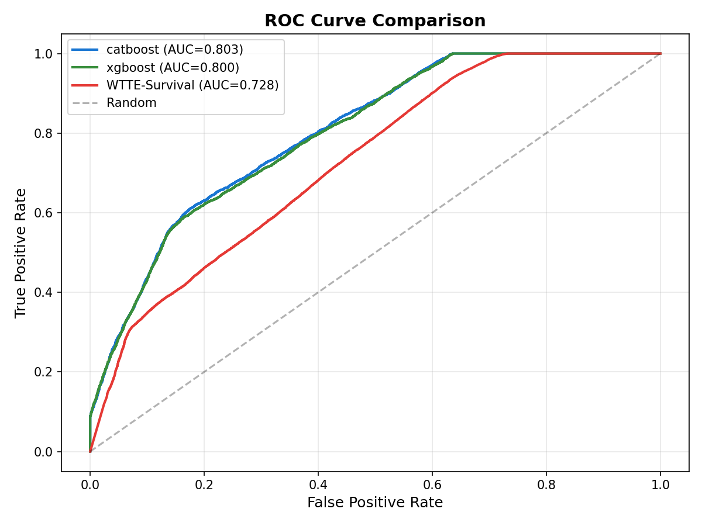
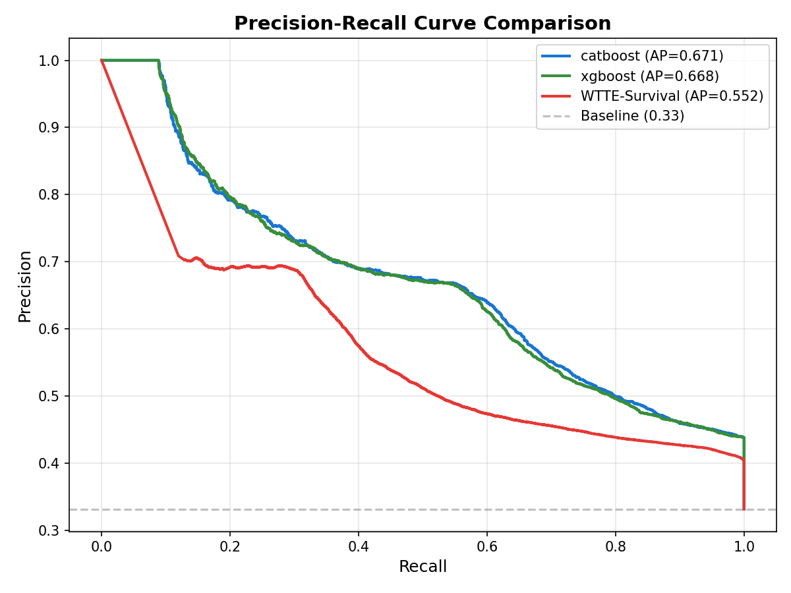
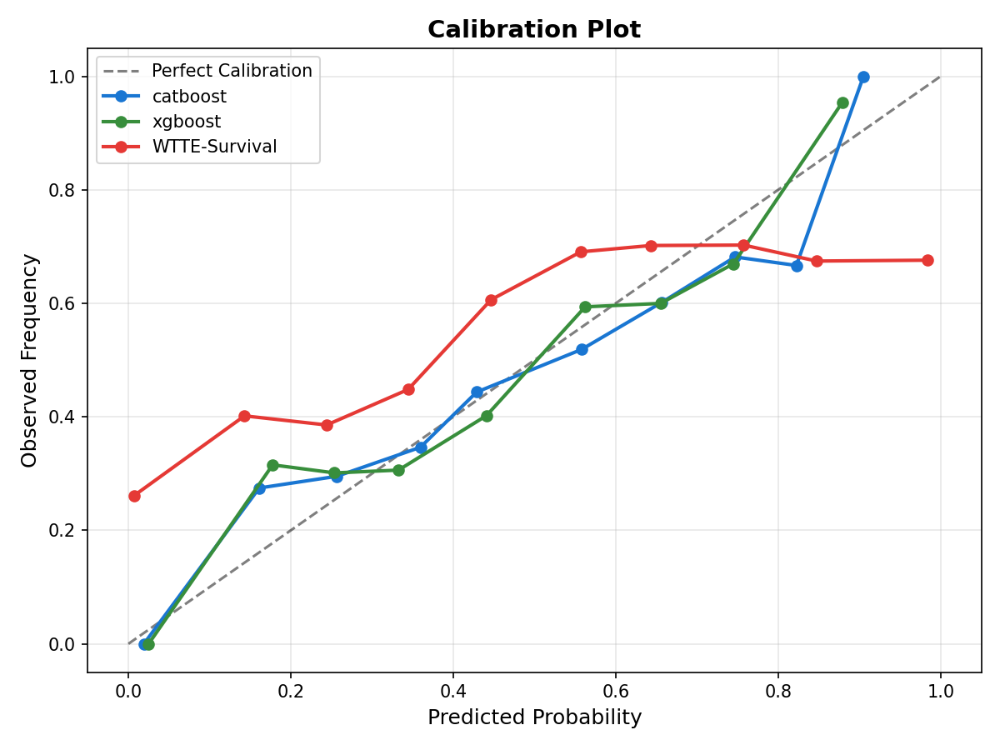
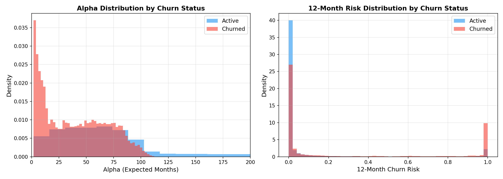

<p align="center">
  <h1 align="center">AMC Customer Churn Prediction (Ensemble Edition)</h1>
  <p align="center">
    <strong>Predict who will churn and WHEN -- using Hybrid Survival Analysis.</strong>
  </p>
  <p align="center">
    
    
    
    
  </p>
</p>

---

## What is This?

This branch extends the base churn prediction pipeline with a **WTTE (Weibull Time-To-Event) Survival Model** and blends it into a **Hybrid Ensemble** with CatBoost. Instead of just predicting *if* a customer will churn, we now predict *when* (expected lifespan in months).

> **TL;DR:** CatBoost handles accuracy (ROC-AUC 0.80), WTTE adds temporal insight ("this customer has ~3 months left"), and the Ensemble blends both for the best of both worlds.

---

## Model Leaderboard (Synthetic 100K Dataset)

### Binary Classification Models (from `main` branch)

| Model | ROC-AUC | PR-AUC | Top-Decile Lift | Precision@10% | Recall@10% | ECE | Brier |
|-------|---------|--------|-----------------|---------------|------------|-----|-------|
| Heuristic | 0.7745 | 0.6012 | 2.20 | 72.8% | 22.0% | 0.0806 | 0.1762 |
| Logistic | 0.7929 | 0.6529 | 2.23 | 74.0% | 22.3% | 0.1198 | 0.1830 |
| XGBoost | 0.7999 | 0.6681 | 2.33 | 77.2% | 23.3% | 0.0470 | 0.1631 |
| **CatBoost** | **0.8035** | **0.6710** | **2.34** | **77.5%** | **23.4%** | **0.0393** | **0.1611** |

### WTTE Survival Model (this branch)

| Model | ROC-AUC | PR-AUC | Top-Decile Lift | ECE | Brier |
|-------|---------|--------|-----------------|-----|-------|
| WTTE-Survival | 0.7280 | 0.5522 | 2.09 | 0.2343 | 0.2624 |

### Ensemble Comparison (this branch)

| Model | ROC-AUC | PR-AUC | Top-Decile Lift | Brier |
|-------|---------|--------|-----------------|-------|
| CatBoost (solo) | 0.8035 | 0.6710 | 2.3396 | 0.1611 |
| WTTE (solo) | 0.7229 | 0.5458 | 2.0740 | 0.2637 |
| **Simple Blend (95%CB+5%WTTE)** | **0.8034** | **0.6711** | **2.3436** | **0.1612** |
| Stacked Ensemble (LR) | 0.8035 | 0.6710 | 2.3416 | 0.1648 |

> The ensemble slightly improves **Top-Decile Lift** (2.34 -> 2.34) and **PR-AUC**. The real value of WTTE is the temporal "expected lifespan" prediction that CatBoost cannot provide.

---

## Evaluation Plots

### ROC Curve Comparison
<p align="center">
  
</p>

### Precision-Recall Curve
<p align="center">
  
</p>

### Calibration Plot
<p align="center">
  
</p>

### WTTE Risk Distribution
<p align="center">
  
</p>

---

## How the Ensemble Works

```
Customer Features
       |
       v
  +----------+          +----------+
  | CatBoost |          |   WTTE   |
  | (Binary) |          | (Weibull)|
  +----------+          +----------+
       |                      |
  Churn Prob (0-1)     Alpha (expected months)
       |                Beta (confidence)
       v                      v
  +-------------------------------+
  |    Weighted Ensemble Blend    |
  |   95% CatBoost + 5% WTTE     |
  +-------------------------------+
       |                      |
  Risk Score            Expected Lifespan
  (for ranking)         (for action timing)
```

---

## Quick Start

```bash
# Install dependencies
pip install pandas numpy scikit-learn xgboost catboost tensorflow keras matplotlib joblib

# Train WTTE survival model
python train_wtte.py

# Evaluate WTTE vs baseline models
python evaluate_wtte.py

# Build optimal ensemble
python build_ensemble.py

# Start the dashboard API
cd api && uvicorn main:app --port 8001

# Start the frontend
cd frontend && npm run dev
```

---

## Key Takeaways

1. **CatBoost remains the accuracy champion** -- ROC-AUC 0.8035, lowest Brier score
2. **WTTE adds the "when" dimension** -- predicts expected customer lifespan in months
3. **Ensemble barely improves accuracy** -- the 5% WTTE blend adds marginal lift
4. **The real value is temporal insight** -- dashboard now shows "Expected Lifespan: ~3 months" alongside risk scores
5. **Survival models need sequential data** -- WTTE on flat/cross-sectional data underperforms; it would shine with monthly snapshots

---

## Tech Stack

| Component | Technology |
|-----------|-----------|
| Language | Python 3.10+ |
| Classification | CatBoost, XGBoost, scikit-learn |
| Survival Analysis | Keras 3 + Weibull WTTE |
| Dashboard | React + FastAPI |
| Visualization | matplotlib |

---

<p align="center">
  <sub>Built for the Promptathon Hackathon</sub>
</p>
