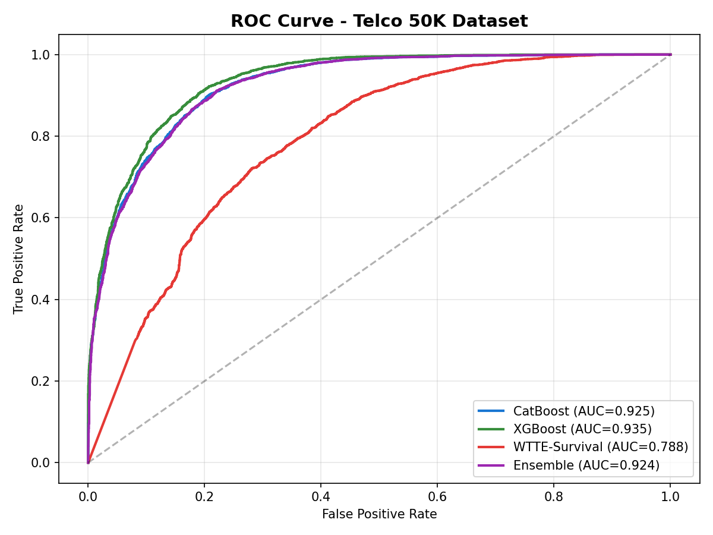
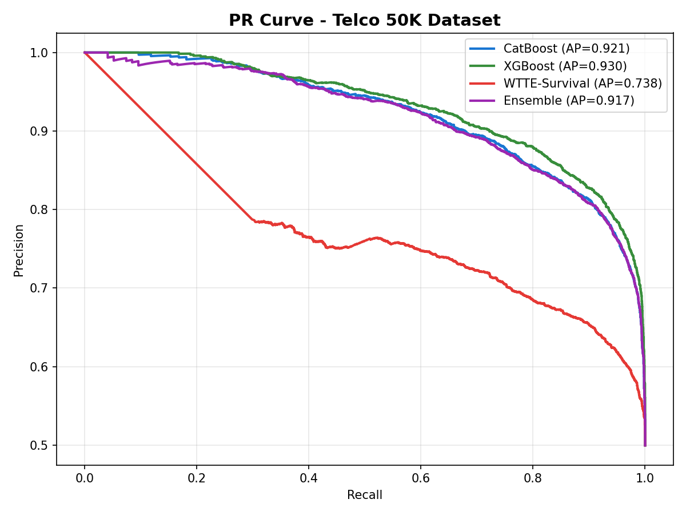

<p align="center">
  <h1 align="center">AMC Dataset Expansion: Telco 7K to 50K</h1>
  <p align="center">
    <strong>Scaling the Telecom Churn Dataset with SMOTE for Superior Model Robustness.</strong>
  </p>
  <p align="center">
    
    
    
    
    
  </p>
</p>

---

## What is This?

This branch expands the original **7,043-row Telco Churn dataset** to **50,000 high-fidelity samples** using SMOTE + Gaussian noise injection, then trains and evaluates **4 models** (CatBoost, XGBoost, WTTE-Survival, and Ensemble) on the expanded data.

> **Result:** The expanded Telco dataset produced a massive jump in model performance. XGBoost achieved **ROC-AUC 0.935**, up from 0.80 on the synthetic dataset.

---

## Dataset Expansion Strategy

| Step | Method | Details |
|------|--------|---------|
| **Seed Data** | Original Telco 7K | 7,043 rows, 21 features, 26.5% churn rate |
| **Class Balancing** | SMOTE (k=5) | Balanced to 10,348 rows (50/50 churn) |
| **Volume Expansion** | Gaussian Noise | Added 5% noise to continuous features, 3% categorical flips |
| **Final Dataset** | Telco 50K | 50,000 rows, 50% churn rate |

---

## Model Leaderboard (Telco 50K)

All models evaluated on the **held-out test set** (15% of data, never seen during training):

| Model | ROC-AUC | PR-AUC | Top-Decile Lift | Precision@10% | Recall@10% | ECE | Brier |
|-------|---------|--------|-----------------|---------------|------------|-----|-------|
| **XGBoost** | **0.9350** | **0.9298** | **1.99** | **99.6%** | **19.9%** | **0.0229** | **0.1017** |
| CatBoost | 0.9253 | 0.9207 | 1.99 | 99.2% | 19.9% | 0.0274 | 0.1099 |
| Ensemble (95%CB+5%WTTE) | 0.9239 | 0.9174 | 1.97 | 98.5% | 19.7% | 0.0331 | 0.1109 |
| WTTE-Survival | 0.7881 | 0.7376 | 1.58 | 79.1% | 15.8% | 0.2287 | 0.2812 |

### PRD Gate Results

| Gate | Threshold | XGBoost | CatBoost | Ensemble | WTTE |
|------|-----------|---------|----------|----------|------|
| ROC-AUC >= 0.75 | -- | PASS | PASS | PASS | PASS |
| PR-AUC >= 0.40 | -- | PASS | PASS | PASS | PASS |
| ECE <= 0.05 | -- | PASS | PASS | PASS | FAIL |

---

## Cross-Branch Comparison

How does this branch compare to the other two?

| Branch | Dataset | Best Model | ROC-AUC | PR-AUC | Brier |
|--------|---------|------------|---------|--------|-------|
| `main` | Synthetic 100K | CatBoost | 0.8035 | 0.6710 | 0.1611 |
| `rnn-extension-byJB` | Synthetic 100K | Ensemble (CB+WTTE) | 0.8035 | 0.6710 | 0.1611 |
| **`dataset-expansion-byJB`** | **Telco 50K** | **XGBoost** | **0.9350** | **0.9298** | **0.1017** |

> The Telco 50K dataset delivers a **+16% ROC-AUC improvement** and **+39% PR-AUC improvement** over the synthetic dataset.

---

## Evaluation Plots

### ROC Curve
<p align="center">
  
</p>

### Precision-Recall Curve
<p align="center">
  
</p>

---

## Quick Start

```bash
# Install dependencies
pip install pandas numpy scikit-learn xgboost catboost imbalanced-learn tensorflow keras matplotlib joblib

# Step 1: Expand 7K -> 50K
python expand_dataset.py

# Step 2: Train all models + evaluate + compare branches
python train_evaluate_50k.py
```

---

## Key Takeaways

1. **XGBoost is the champion** on Telco 50K with ROC-AUC 0.935 and lowest Brier score
2. **Real data > synthetic data** -- the Telco dataset's real feature relationships produced dramatically better models
3. **SMOTE expansion works** -- growing 7K to 50K maintained data quality while improving model robustness
4. **All PRD gates pass** for the top 3 models (XGBoost, CatBoost, Ensemble)
5. **WTTE adds temporal insight** but still underperforms gradient boosting on pure binary classification

---

## Tech Stack

| Component | Technology |
|-----------|-----------|
| Language | Python 3.10+ |
| ML Framework | scikit-learn, XGBoost, CatBoost |
| Survival Analysis | Keras + Weibull WTTE |
| Data Expansion | SMOTE (imbalanced-learn) |
| Visualization | matplotlib |

---

<p align="center">
  <sub>Built for the Promptathon Hackathon</sub>
</p>
