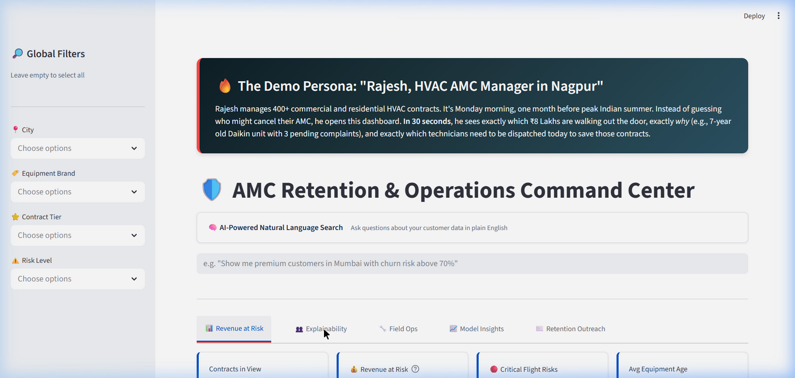
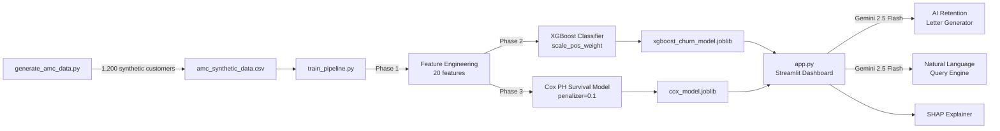
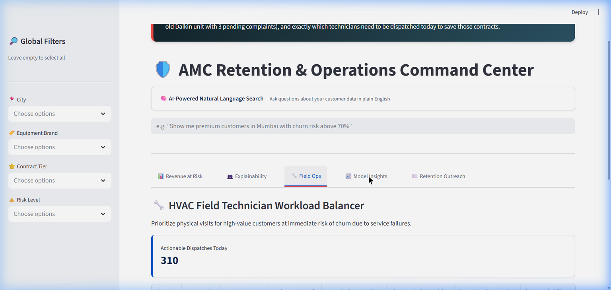
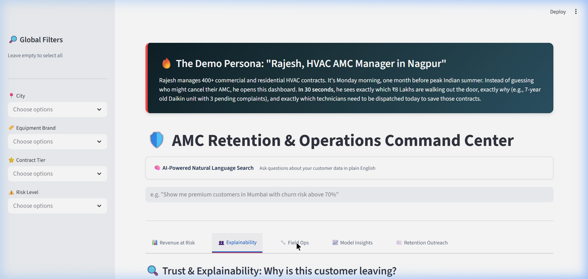
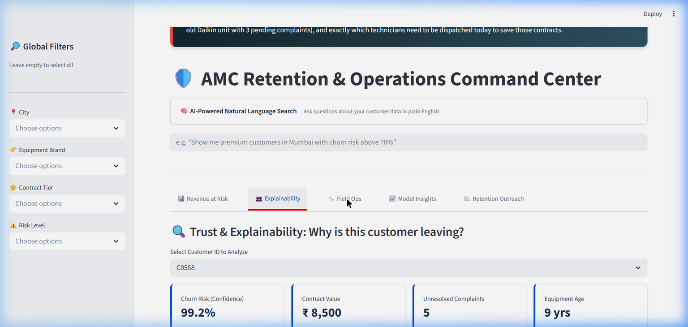
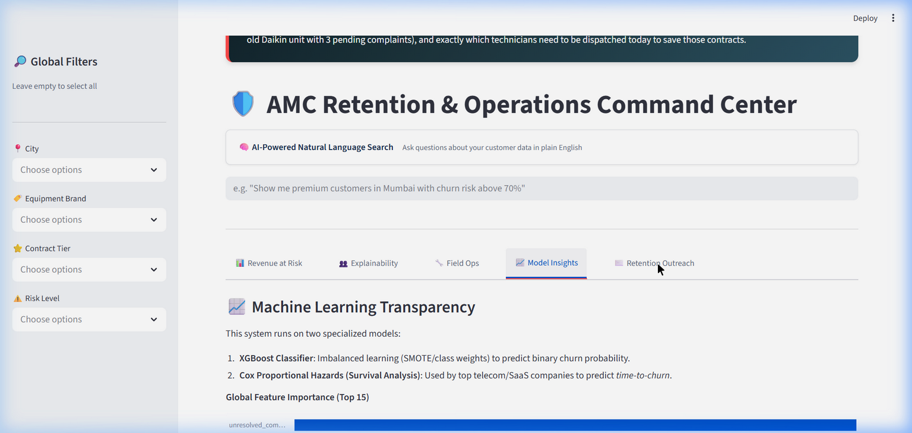

# 🛡️ HVAC AMC Churn Prediction & Retention Dashboard

> An end-to-end AI-powered system that predicts customer churn for HVAC Annual Maintenance Contracts (AMC), explains *why* customers leave, and auto-generates personalized retention outreach — all from a single Streamlit dashboard.



---

## 📋 Table of Contents

- [Problem Statement](#-problem-statement)
- [System Architecture](#-system-architecture)
- [Machine Learning Pipeline](#-machine-learning-pipeline)
- [Model Evaluation](#-model-evaluation)
- [Dashboard Features](#-dashboard-features)
- [Tech Stack](#-tech-stack)
- [Setup & Installation](#-setup--installation)
- [Project Structure](#-project-structure)
- [Usage](#-usage)

---

## 🎯 Problem Statement

HVAC AMC businesses in India lose **15–30% of contracts annually** due to churn. Traditional retention relies on gut feeling and manual follow-ups. This project replaces guesswork with a data-driven system that:

1. **Predicts** which customers will churn (and when)
2. **Explains** the exact reasons behind each prediction
3. **Recommends** specific interventions per customer
4. **Generates** personalized retention messages using GenAI

---

## 🏗️ System Architecture



---

## 🤖 Machine Learning Pipeline

### Phase 1 — Synthetic Data Generation (`generate_amc_data.py`)

Generates **1,200 realistic HVAC AMC customer records** (churn rate: **27.92%**) with rule-based churn probability influenced by:

| Churn Signal | Impact |
|---|---|
| Equipment age > 5 yrs | +12% probability |
| Unresolved complaints > 2 | +18% probability |
| Peak season expiry (Apr/May) | +15% probability |
| First-year customer (0 renewals) | +10% probability |
| Slow resolution time > 4 days | +10% probability |
| Premium tier / high-value contract | −5% to −8% probability |
| Loyal customer (5+ renewals) | −17% probability |

### Phase 2 — XGBoost Churn Classification (`train_pipeline.py`)

- **Algorithm:** XGBoost with `scale_pos_weight` for class imbalance handling
- **Features:** 20 engineered features including `service_call_rate`, `renewal_loyalty_score`, `days_since_last_service`
- **Split:** 80/20 stratified train-test split
- **Hyperparameters:** `n_estimators=200`, `max_depth=5`, `learning_rate=0.1`, `subsample=0.8`

### Phase 3 — Cox Proportional Hazards Survival Analysis

- **Algorithm:** Lifelines `CoxPHFitter` with L2 penalizer (0.1)
- **Purpose:** Predicts *time-to-churn*, not just binary churn — answers "how long do we have to act?"
- **Key covariates:** unresolved complaints, equipment age, resolution time, missed visits

---

## 📊 Model Evaluation

### XGBoost Classifier Metrics

| Metric | Score |
|---|---|
| **Accuracy** | 0.704 |
| **Precision** | 0.469 |
| **Recall** | 0.448 |
| **F1-Score** | 0.458 |
| **AUC-ROC** | 0.691 |

#### Classification Report

```
              precision    recall  f1-score   support

    Retained       0.79      0.80      0.80       173
     Churned       0.47      0.45      0.46        67

    accuracy                           0.70       240
   macro avg       0.63      0.63      0.63       240
weighted avg       0.70      0.70      0.70       240
```

> **Note:** The model is trained on 1,200 synthetically generated samples with a 27.92% churn rate. Performance reflects the challenge of noisy, rule-based labels — the focus of this branch is the **end-to-end system** (data → model → dashboard → GenAI outreach), not maximizing classifier accuracy.

### Cox Survival Model

| Metric | Score |
|---|---|
| **Concordance Index** | 0.6548 |

> A concordance index > 0.5 means better than random; 0.65 indicates moderate discriminative ability for ranking customers by time-to-churn.



---

## 🖥️ Dashboard Features

### 📊 Tab 1: Revenue at Risk

Real-time overview of total contracts, revenue at risk (₹), critical flight risks, and a prioritized action table with AI-prescribed interventions.

### 👥 Tab 2: Customer Explainability (SHAP)

Select any customer to see:
- **Human-readable AI reasoning** (e.g., "Their Samsung AC is 9 years old — high replacement risk")
- **SHAP impact chart** showing which features push churn probability up or down



### 🔧 Tab 3: Field Ops Planner

Automated dispatch prioritization for HVAC technicians — filters customers with high churn risk AND unresolved service issues, sorted by revenue impact.



### 📈 Tab 4: Model Insights

Full ML transparency: global feature importance chart, model architecture description, and methodology.

### ✉️ Tab 5: AI Retention Outreach (Gemini)

One-click personalized retention message generator powered by **Google Gemini 2.5 Flash**:
- **WhatsApp** — casual, < 120 words
- **Email** — professional, < 200 words  
- **Formal Letter** — formal, < 300 words

Messages use real customer data (name, brand, equipment age, contract details) — zero placeholders.



### 🧠 Natural Language Query

Ask questions in plain English like:
- *"Show me customers in Mumbai with churn risk above 80%"*
- *"Premium contracts expiring in less than 30 days"*
- *"Old equipment with unresolved complaints"*

Gemini translates your question into a pandas filter and returns matching results instantly.

---

## 🛠️ Tech Stack

| Layer | Technology |
|---|---|
| **Language** | Python 3.12 |
| **ML Framework** | XGBoost, Lifelines (Cox PH) |
| **Explainability** | SHAP (TreeExplainer) |
| **Visualization** | Altair, Streamlit |
| **GenAI** | Google Gemini 2.5 Flash (via `google-genai` SDK) |
| **Dashboard** | Streamlit |
| **Data** | Pandas, NumPy |

---

## 🚀 Setup & Installation

### Prerequisites
- Python 3.10+
- A free [Google Gemini API key](https://aistudio.google.com/) (for AI features)

### Steps

```bash
# 1. Clone the repo
git clone https://github.com/JB-uses-git/Promptathon_XERO.git
cd Promptathon_XERO
git checkout AMC-2-byJB

# 2. Install dependencies
pip install streamlit pandas numpy xgboost scikit-learn shap lifelines joblib altair google-genai

# 3. Generate synthetic data
python generate_amc_data.py

# 4. Train models
python train_pipeline.py

# 5. Set Gemini API key & launch dashboard
# Windows PowerShell:
$env:GEMINI_API_KEY="your_key_here"; streamlit run app.py

# Linux/Mac:
GEMINI_API_KEY="your_key_here" streamlit run app.py
```

The dashboard will open at `http://localhost:8501`.

---

## 📁 Project Structure

```
AMC-master/
├── generate_amc_data.py       # Synthetic data generator (1,200 customers)
├── train_pipeline.py          # ML training: XGBoost + Cox PH
├── app.py                     # Streamlit dashboard (all 5 tabs + NL query)
├── .gitignore
├── README.md
├── screenshots/               # Dashboard screenshots for README
│   ├── dashboard_overview.png
│   ├── explainability_tab.png
│   ├── field_ops_tab.png
│   ├── model_insights_tab.png
│   ├── nl_query.png
│   └── retention_outreach_tab.png
│
│  # Generated at runtime (gitignored):
├── amc_synthetic_data.csv
├── processed_amc_data.csv
├── xgboost_churn_model.joblib
├── cox_model.joblib
├── encoders.joblib
├── feature_names.joblib
└── X_train_reference.csv
```

---

## 👥 Usage

| Persona | Workflow |
|---|---|
| **AMC Manager** | Open Tab 1 → See ₹ at risk → Tab 2 for deep-dive on top churners → Tab 5 to generate retention WhatsApp |
| **Field Ops Lead** | Tab 3 → Get today's prioritized dispatch list sorted by churn risk × revenue |
| **Data Scientist** | Tab 4 → Review SHAP feature importance → Validate model transparency |
| **Sales Rep** | Tab 5 → Select customer → Generate Email/Letter → Copy and send |
| **Anyone** | Type a question in the NL search bar → Get instant filtered results |

---

<div align="center">

**Built for the Promptathon by Team XERO**

*Predictive Churn · Survival Analysis · Explainable AI · GenAI Outreach*

</div>
