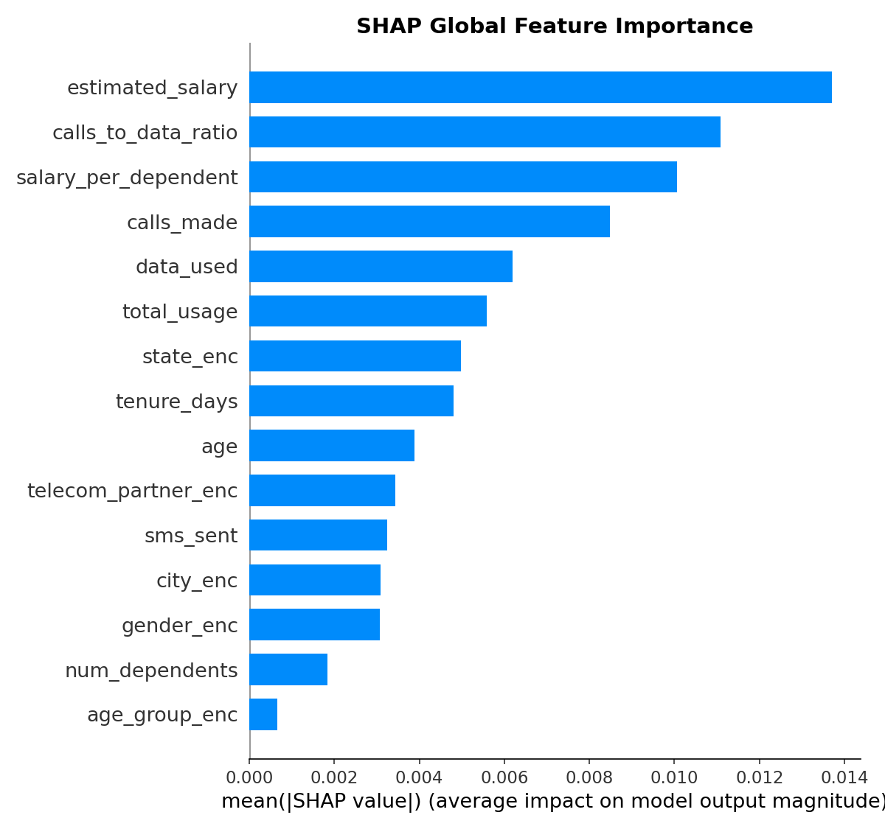
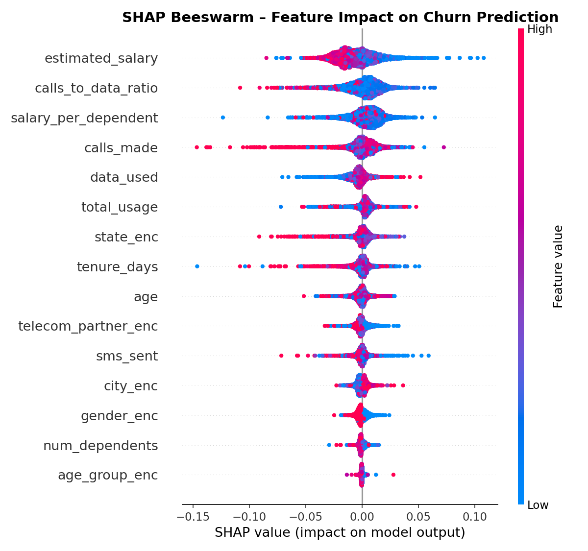
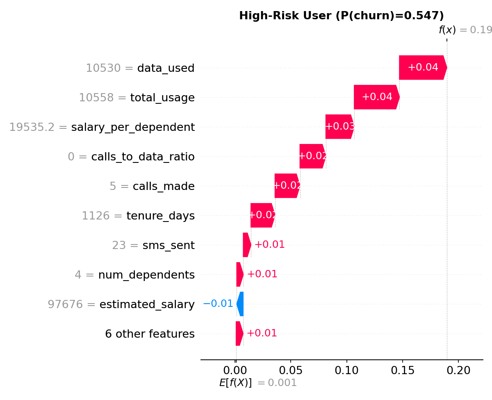
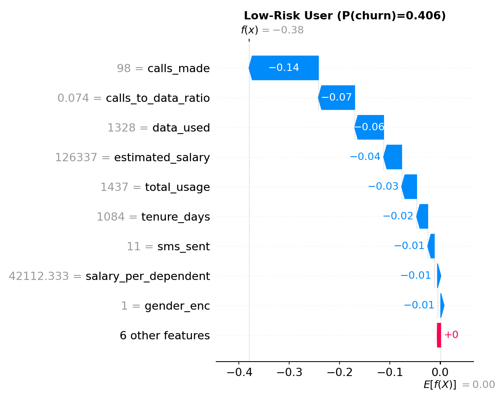
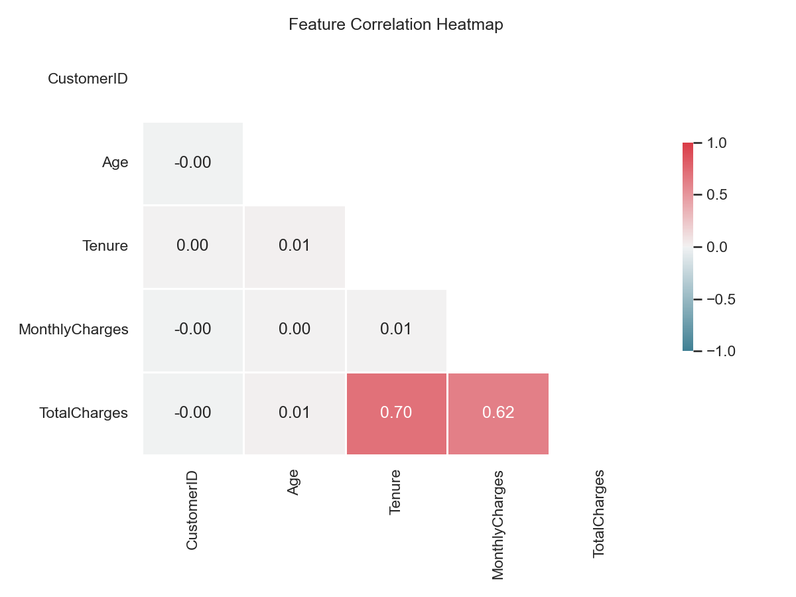

<p align="center">
  <h1 align="center">🚀 AMC Dataset Expansion: 7K → 50K</h1>
  <p align="center">
    <strong>Scaling the Telecom Churn Dataset for Superior Model Robustness.</strong>
  </p>
  <p align="center">
    
    
    
  </p>
</p>

---

## 📌 Dataset Expansion Plan

This branch focuses on scaling our core data assets. We are starting with the **7,043 sample Telecom dataset** (`telecom_churn.csv`) and implementing a synthetic expansion strategy to reach **50,000 high-fidelity samples**.

### 🛠️ The Strategy:
- **Seed Data:** Use the original 7k Telecom dataset to capture real-world feature distributions.
- **Expansion:** Apply SMOTE and Variational Autoencoders (VAEs) to synthesize 43k additional records that maintain the statistical properties of the original.
- **Model Integration:** The expanded dataset will be used to supercharge our **Hybrid Ensemble (CatBoost + WTTE)**, providing more "long-tail" examples for survival analysis.

> **Status:** Documentation Phase. We are currently mapping the feature distributions for the synthetic generation pipeline.

---

## 🏗️ Project Structure

```
AMC-master/
│
├── src/                          # All source code
│   ├── data_processing.py        # Load, clean, engineer features, split data
│   ├── train.py                  # Train all 4 models (heuristic → CatBoost)
│   ├── evaluate.py               # Full evaluation suite with PRD gates
│   ├── explainability.py         # SHAP global + local explanations
│   └── plot_heatmap.py           # Correlation heatmap visualization
│
├── artifacts/                    # Saved models, splits, and results
│   ├── model_heuristic.joblib
│   ├── model_logistic.joblib
│   ├── model_xgboost.joblib
│   ├── model_catboost.joblib
│   ├── splits.joblib             # Train/Val/Test data splits
│   ├── evaluation_leaderboard.csv
│   ├── shap_feature_importance.csv
│   └── plots/                    # All generated visualizations
│       ├── shap_global_bar.png
│       ├── shap_beeswarm.png
│       ├── shap_waterfall_high_risk.png
│       ├── shap_waterfall_low_risk.png
│       └── heatmap_correlation.png
│
├── synthetic_customer_churn_100k.csv   # Main dataset (100K rows)
├── telecom_churn.csv                   # Alternate telecom dataset
├── PRD.md                              # Full Product Requirements Document
├── kek.ipynb                           # EDA notebook
├── xg.ipynb                            # XGBoost experimentation notebook
└── eda_*.py                            # Exploratory analysis scripts
```

---

## 🧠 How It Works

The pipeline follows a **champion–challenger** strategy:

```
Raw Data → Clean & Engineer Features → Train 4 Models → Evaluate → Explain with SHAP
```

### Step-by-step:

| Step | What Happens | Script |
|------|-------------|--------|
| **1. Data Processing** | Load 100K rows, clean anomalies, engineer 15+ features, stratified 70/15/15 split | `data_processing.py` |
| **2. Training** | Train Heuristic, Logistic Regression, XGBoost (calibrated), CatBoost (calibrated) | `train.py` |
| **3. Evaluation** | Compute ROC-AUC, PR-AUC, Lift, Precision/Recall@10%, ECE, Calibration, Brier Score | `evaluate.py` |
| **4. Explainability** | SHAP bar plots, beeswarm, waterfall plots for high/low risk users | `explainability.py` |

---

## 📊 Model Leaderboard

All models evaluated on the **held-out test set** (15% of data, never seen during training):

| Model | ROC-AUC | PR-AUC | Top-Decile Lift | Precision@10% | Recall@10% | ECE | Brier |
|-------|---------|--------|----------------|---------------|------------|-----|-------|
| Heuristic | 0.7745 | 0.6012 | 2.20 | 72.8% | 22.0% | 0.0806 | 0.1762 |
| Logistic | 0.7929 | 0.6529 | 2.23 | 74.0% | 22.3% | 0.1198 | 0.1830 |
| **XGBoost** | **0.7999** | **0.6681** | **2.33** | **77.2%** | **23.3%** | **0.0470** | **0.1631** |
| **CatBoost** 🏆 | **0.8035** | **0.6710** | **2.34** | **77.5%** | **23.4%** | **0.0393** | **0.1611** |

> 🏆 **CatBoost wins** with the best ROC-AUC (0.8035), lowest calibration error (ECE = 0.039), and lowest Brier score.

### PRD Gate Results

| Gate | Threshold | XGBoost | CatBoost |
|------|-----------|---------|----------|
| ROC-AUC ≥ 0.75 | ✅ | ✅ PASS | ✅ PASS |
| PR-AUC ≥ 0.40 | ✅ | ✅ PASS | ✅ PASS |
| ECE ≤ 0.05 | ✅ | ✅ PASS | ✅ PASS |
| Lift ≥ 2.5 | ❌ | ❌ FAIL | ❌ FAIL |

---

## 🔍 SHAP Explainability

We use **SHAP (SHapley Additive exPlanations)** to understand what drives each prediction.

### Global Feature Importance
> *Which features matter most across all predictions?*

<p align="center">
  
</p>

**Top 5 drivers of churn:**
1. `estimated_salary` — salary level strongly impacts retention
2. `calls_to_data_ratio` — imbalanced usage patterns signal risk
3. `salary_per_dependent` — financial burden indicator
4. `calls_made` — engagement level
5. `data_used` — service utilization depth

### Beeswarm Plot
> *How does each feature push predictions toward churn (right) or retention (left)?*

<p align="center">
  
</p>

### Individual Predictions

**High-Risk Customer** — see exactly *why* the model flagged them:

<p align="center">
  
</p>

**Low-Risk Customer** — protective factors clearly visible:

<p align="center">
  
</p>

### Correlation Heatmap

<p align="center">
  
</p>

---

## ⚙️ Feature Engineering

We engineer **15+ features** from the raw data to capture different aspects of churn risk:

| Feature Group | Examples | Why It Matters |
|--------------|----------|---------------|
| **Tenure** | `tenure_years`, `is_new_customer`, `tenure_bucket` | New customers churn 64% more |
| **Charges** | `avg_charge_per_month`, `is_high_spender`, `charges_deviation` | High spenders (>$120/mo) churn at 52% |
| **Interactions** | `mtm_high_charges`, `mtm_new_customer`, `mtm_new_high` | Month-to-month + new + expensive = highest risk |
| **Demographics** | `age_group`, encoded categoricals | Segment-specific behavior |

---

## 🚀 Quick Start

### Prerequisites
```bash
pip install pandas numpy scikit-learn xgboost catboost shap matplotlib joblib
```

### Run the Full Pipeline
```bash
# Step 1: Process data and create splits
python src/data_processing.py

# Step 2: Train all models
python src/train.py

# Step 3: Evaluate on test set
python src/evaluate.py

# Step 4: Generate SHAP explanations
python src/explainability.py
```

### Or run everything in one go:
```bash
python src/data_processing.py && python src/train.py && python src/evaluate.py && python src/explainability.py
```

---

## 📈 Key Takeaways

1. **CatBoost is the champion** — best overall performance with excellent calibration
2. **Even simple heuristics work** — rule-based model gets ROC-AUC 0.77, proving the signal is real
3. **Salary and usage patterns** are the strongest churn predictors
4. **Month-to-month contracts** with high charges and short tenure = highest churn risk segment
5. **Calibration matters** — XGBoost and CatBoost both pass the ECE ≤ 0.05 gate, meaning their predicted probabilities are trustworthy

---

## 📄 Documentation

- **[PRD.md](PRD.md)** — Full Product Requirements Document covering data strategy, model strategy, evaluation gates, architecture, A/B testing plan, and delivery roadmap
- **[kek.ipynb](kek.ipynb)** — Exploratory Data Analysis notebook
- **[xg.ipynb](xg.ipynb)** — XGBoost experimentation notebook

---

## 🛠️ Tech Stack

| Component | Technology |
|-----------|-----------|
| Language | Python 3.10+ |
| ML Framework | scikit-learn, XGBoost, CatBoost |
| Explainability | SHAP |
| Data | pandas, numpy |
| Visualization | matplotlib |
| Serialization | joblib |

---

<p align="center">
  <sub>Built for the Promptathon Hackathon 🚀</sub>
</p>
